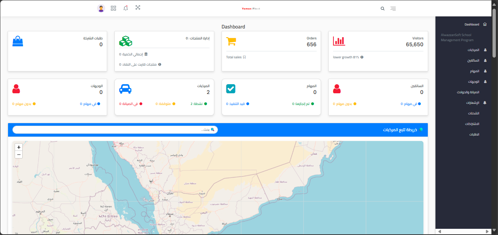
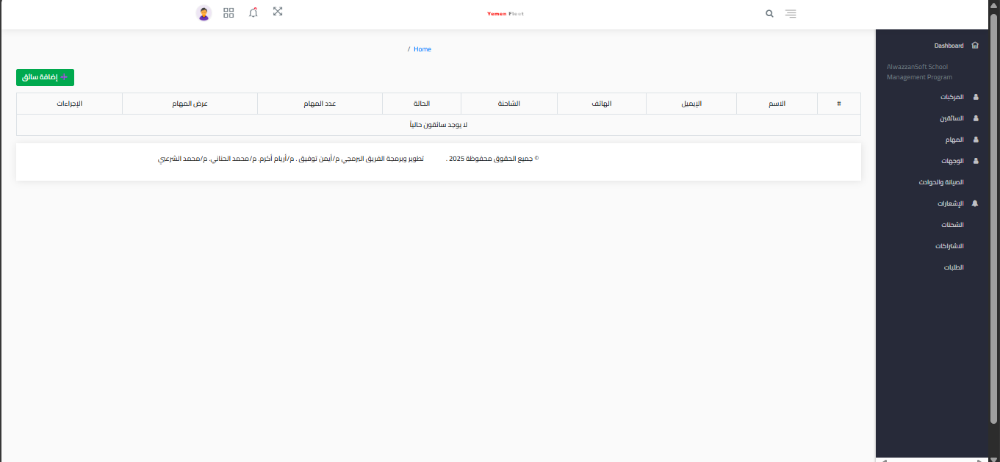
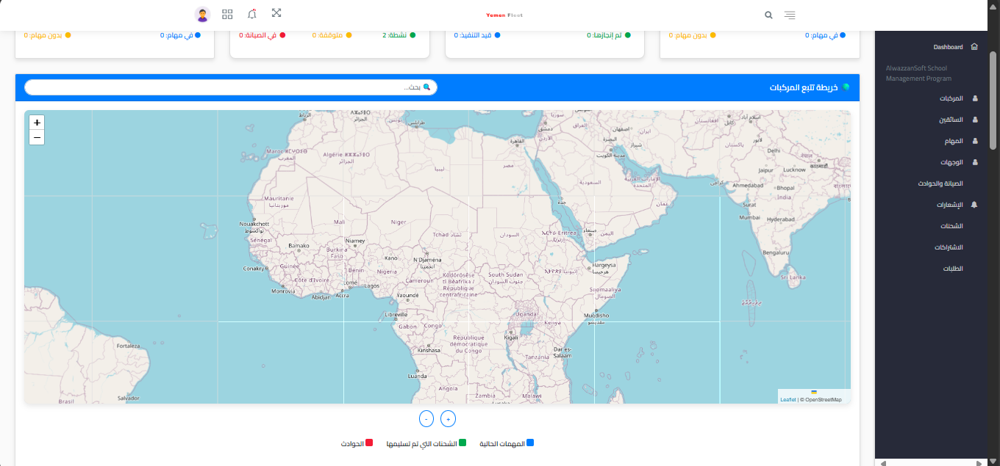
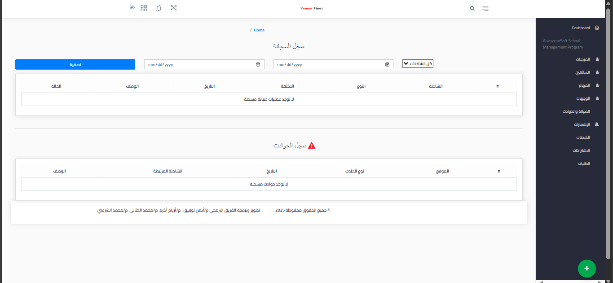

# 🏢 Yemen Fleet - لوحة تحكم الشركة

<p align="center">
  
  <br>
  
  
  
</p>

## 🌟 نظرة عامة
لوحة تحكم متكاملة للشركات العاملة في نظام Yemen Fleet تمكنك من:
- 🚛 **إدارة أسطول الشاحنات**
- 👨‍✈️ **توزيع السائقين**
- 📦 **متابعة الطلبات**
- 📊 **تحليل الأداء**

## 🖼️ لقطات من النظام

<div align="center">
  <h3>اللوحة الرئيسية</h3>
  
  
  <div class="grid">
    <div>
      <h4>إدارة السائقين</h4>
      
    </div>
    <div>
      <h4>تتبع الطلبات</h4>
      
    </div>
  </div>

  <h3 style="margin-top:30px">إدارة الشاحنات</h3>
  
</div>

## 🔧 الميزات الرئيسية

### 🚚 إدارة الأسطول
- تسجيل الشاحنات والمركبات
- جدولة الصيانة الدورية
- تتبع مواقع المركبات

### 📦 نظام الطلبات
| الميزة | الوصف |
|--------|-------|
| لوحة الطلبات | عرض جميع الطلبات مع فلترات متقدمة |
| تتبع حي | مشاهدة مواقع السائقين على الخريطة |
| تقارير التسليم | إشعارات وتقارير التسليم |

### 📊 التحليلات
mermaid
pie
  title توزيع الطلبات
  "مكتمل" : 65
  "قيد التوصيل" : 20
  "ملغى" : 5
  "معلق" : 10
🛠️ التقنيات المستخدمة
Diagram
Code


🚀 البدء السريع
المتطلبات
PHP 8.2+

Composer

Node.js 16+

التنصيب
bash
git clone https://github.com/770883616/Yemen-Fleet-Dashboard-Companies.git
cd Yemen-Fleet-Company-Portal
composer install
npm install && npm run dev
cp .env.example .env
php artisan key:generate
php artisan migrate --seed

📞 الدعم الفني
<div class="contact-box"> <div>  <h4>الدعم الفني</h4> <p>support@yemenfleet.com</p> </div> <div>  <h4>واتساب</h4> <p>+967 770 883 615</p> </div> </div><style> .screenshot { border: 1px solid #ddd; border-radius: 8px; box-shadow: 0 4px 12px rgba(0,0,0,0.1); margin: 20px 0; } .grid { display: grid; grid-template-columns: 1fr 1fr; gap: 20px; margin: 30px 0; } .contact-box { display: flex; justify-content: center; gap: 50px; margin: 40px 0; text-align: center; } </style><div align="center" style="margin-top:50px"> <sub>© 2024 Yemen Fleet. جميع الحقوق محفوظة</sub> </div> ```